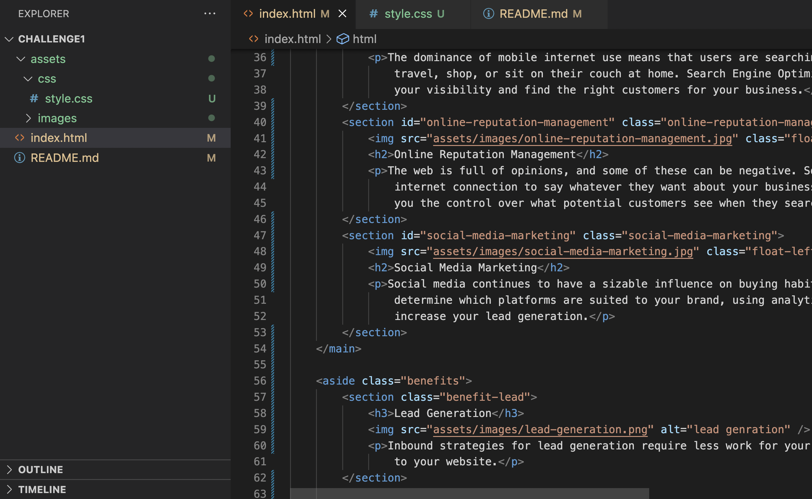

<<<<<<< HEAD
# User story
As a bootcamp student, I want to modify existed HTML and CSS files to make the website meets 
accessibiliyt standards.

I have used display:inline-block; to place two blocks stand next to each other. 

I have used max-width to control over large image files
=======
# <challenge1>

## Description
I want a codebase that follows accessibility standardsso that the site is optimized for search engines.
I need to replace all the 
 elements with a sytax or with the semantic HTML elements. second, I also need to add an alt attributes in order to make other people know the content of the image even though it's not able to load. Third, I also simplfied code in CSS files by combining two or more elements with the same features with "," in between with different classes. 

## Installation

need a web browser

## Usage

    

## Credits
Jingru Sun https://github.com/jingruS/Challenge1
Tutor: Phillip Loy(giving directions and suggestions)

## License
n/a

## Badges

Badges aren't necessary, per se, but they demonstrate street cred. Badges let other developers know that you know what you're doing. Check out the badges hosted by [shields.io](https://shields.io/). You may not understand what they all represent now, but you will in time.

>>>>>>> fbbb87a ( first revision after speak with tutor)
